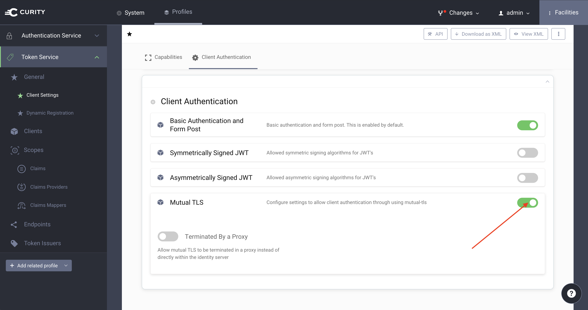
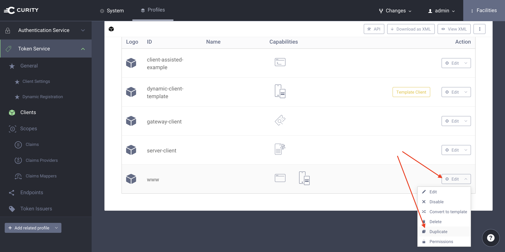
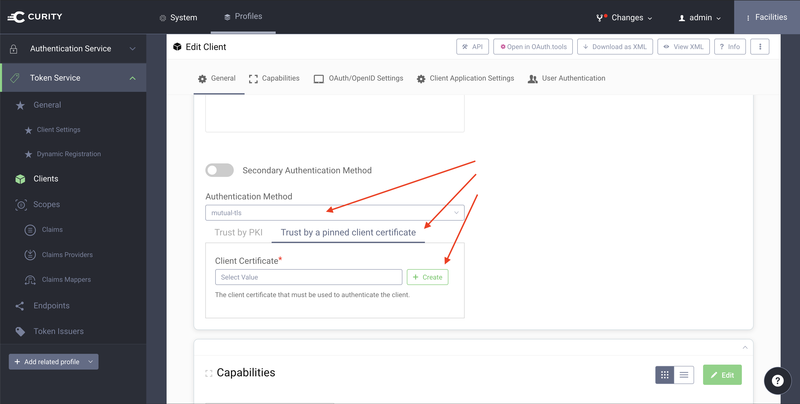
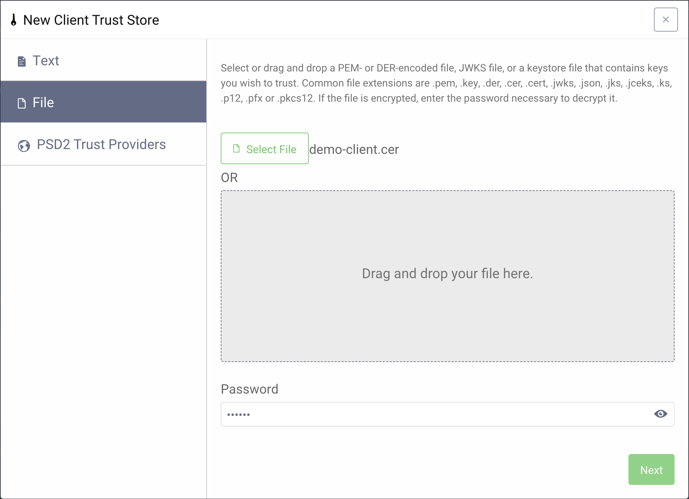
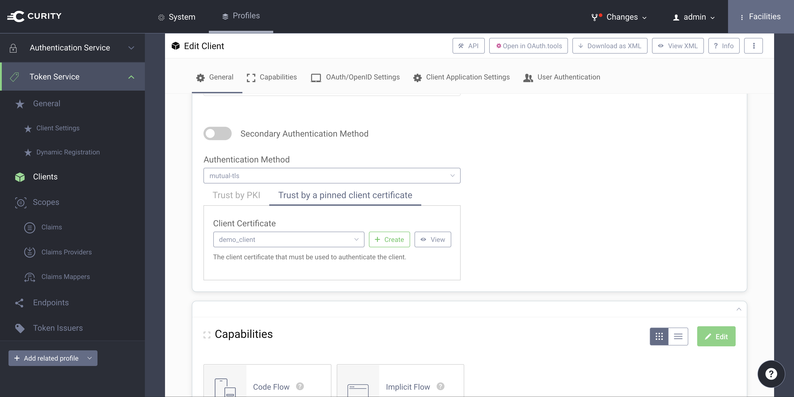
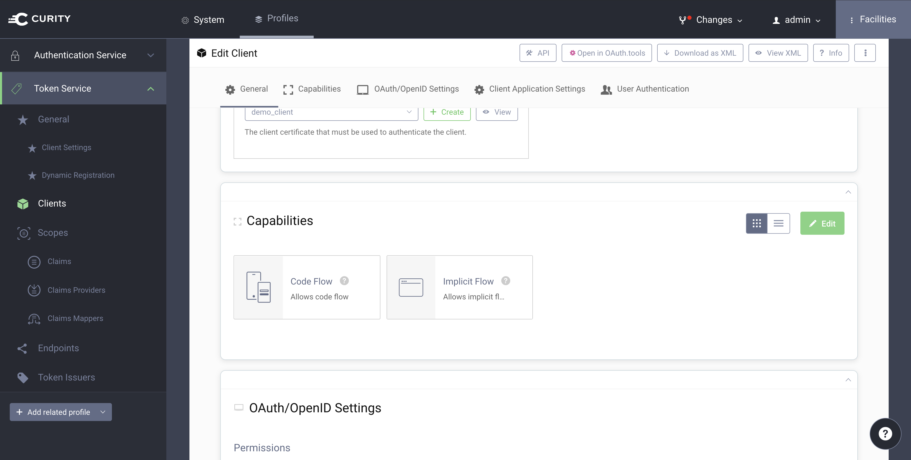
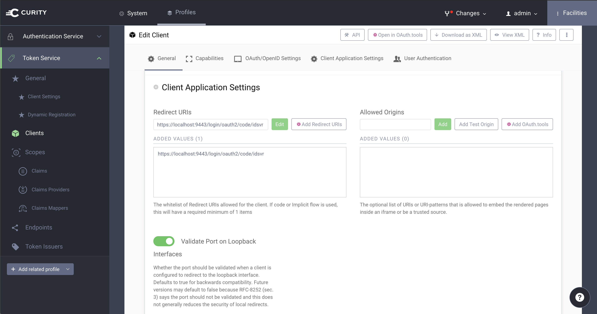
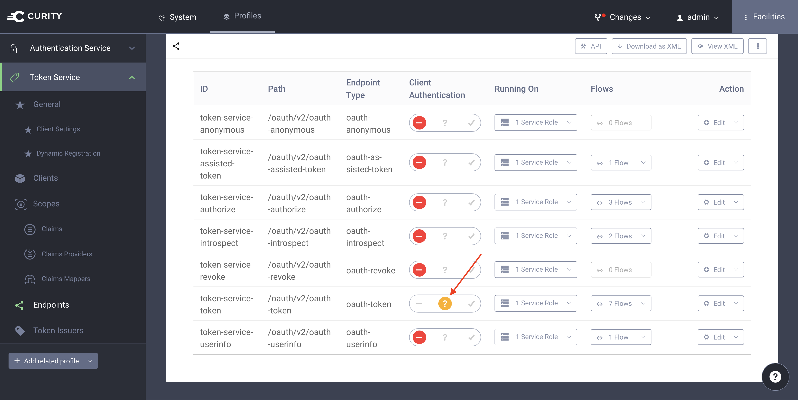

# OpenID Client with Spring Boot and mutual TLS Client Authentication
This repository contains an example implementation that demonstrate how to use Spring Boot and Spring Security to create an OpenID lient that authenticates to the Curity Identity Server using mutual TLS.

There are only two things to consider when configuring the client in the Curity Identity Server:

* choose the authentication method `mutual tls` and make sure it uses the self-signed certificate created below. 
* register the following redirect uri for your client: `http://localhost:8080/login/oauth2/code/idsvr`. 

The redirect uri is the path of the application where the Curity Identity Server will redirect to after the user was authenticated. In this case we assume that this example will be hosted on `localhost`. 

## Create a Self-Signed Certificate
For mutual TLS client authentication to work you need a client certificate. Create a Java keystore with the self-signed certificate.

```bash
keytool -genkey -alias demo-client -keyalg RSA -keysize 4096 -keystore demo-client.p12 -storepass Secr3t -storetype pkcs12 -validity 10 -dname "CN=demo-client, OU=Example, O=Curity AB, C=SE"
```

Place the key store in `src/main/resources`. See [Configure Application](#configure-application) for details.

Export the certificate and use it to configure the client at the Curity Identity Server. See [Curity Identity Server Configuration](#curity-identity-server-configuration).

```bash
keytool -export -alias demo-client -keystore demo-client.p12 -storepass Secr3t -storetype pkcs12 -file demo-client.cer
```

## Curity Identity Server Configuration
To run this example you need to setup some configurations in the Curity Identity Server. The easiest way is to download and install the sample configuration from [Curity Developer Portal](https://developer.curity.io/release/latest). This sample configuration already has an authentication profile and an OAuth profile that can be used with this example.

1. Go to Token Service profile and make sure that `Mutual TLS` is enabled for `Client Authentication` on the `Client Settings` page of that profile.

   
 
1. Go to the `Clients` page of the profile and create a client called `demo-client`. If you use the sample configuration from [Curity Developer Portal](https://developer.curity.io/release/latest) create the `demo-client` client by copying the example client called `www`.
   
   
   
1. This new client (accessible from `Token Service -> Clients -> demo-client -> Edit Client`) uses mutual TLS for client authentication. 
   * Choose `mutual-tls` from the list of authentication methods.
   * Select `Trust by a pinned client certificate`.
   * Click `Create` to upload a client certificate.

    

1. Select the client certificate that you created [above](#create-a-self-signed-certificate). Give the newly created Client Trust Store the name `demo_client` and confirm the settings.
   
    
   
    
   
1. Continue with the `Capabilities` section for the `demo-client`. Make sure that the list contains at least the `Code Flow` capability.
   
   
   
1. Update the `Redirect URIs` setting for the `demo-client`. The redirect URI should be `http://localhost:8080/login/oauth2/code/idsvr`.
   
   
   
1. Finally, allow Client Authentication for the Token Endpoint. Go to Token Service profile and select `Endpoints`. Look for the `token-service-token` endpoint and set `Client Authentication` to `allowed`.
 
   
          
1. Commit the changes and you are all setup.
   

## Configure Application
Update the client registration and provider in `application.yml` to fit your setup. If you followed the instructions in [Curity Identity Server Configuration](#curity-identity-server-configuration) you do not need to change anything.

```yaml
spring:
  security:
    oauth2:
      client:
        registration:
          idsvr:
            client-name: Spring Boot OpenID Demo Client
            client-id: demo-client
            client-authentication-method: none
            authorization-grant-type: authorization_code
            redirect-uri: "{baseUrl}/login/oauth2/code/{registrationId}"
            scope: openid
        provider:
          idsvr:
            authorizationUri: https://localhost:8443/oauth/v2/oauth-authorize
            tokenUri: https://localhost:8443/oauth/v2/oauth-token
            jwkSetUri: https://localhost:8443/oauth/v2/oauth-anonymous/jwks
```

Place the keystore created above in the `resources` folder and configure the SSL/TLS settings for the oauth client in `application.yml`:

```yaml
custom:
  client:
    ssl:
      key-store: demo-client.p12
      key-store-password: Secr3t
      key-store-type: pkcs12
```

## Trust Server Certificate
The application, in particular the underlying `WebClient` implementations that handle the requests to the token server namely to the Curity Identity Server, must trust the certificate provided by the server. Put the server certificate in a trust store:

```bash
keytool -import -file localhost.cer -alias idsvr -keystore idsvr.p12 -storepass changeit -storetype pkcs12 -noprompt
```

Place the trust store in the `resources` folder and update the SSL/TLS settings for the oauth client in `application.yml`:

```yaml
custom:
    client:
      ssl: 
        trust-store: idsvr.p12
        trust-store-password: changeit
        trust-store-type: pkcs12
```

> **Note** You may use a self signed certificate for the Curity Identity Server but make sure it is a valid certificate for the server name, i.e the certificate must include the hostname of the server in the subject or the list of subject alternative names. The client will otherwise reject the certificate and communication with the server will not work.

## Run the Application
To start the application run 

```bash
./gradlew bootRun
```

Open `http://localhost:8080` in your browser. It will automatically start a login flow.

## More Information
More information about OAuth 2.0, OpenID Connect and the Curity Identity Server can be found here:

* [The Curity Identity Server](https://curity.io)
* [OAuth 2.0](https://curity.io/resources/oauth/)
* [OpenID Connect](https://curity.io/resources/openid-connect/)

Check out the related tutorial of this repository:
* [OIDC Client with Mutual TLS Client Authentication](https://curity.io/resources/tutorials/howtos/writing-clients/oidc-spring-boot-mtls-auth/)

Read up on [OAuth 2.0 Mutual TLS Client Authentication](https://curity.io/resources/architect/oauth/oauth-client-authentication-mutual-tls/)

## Implementation Notes
Spring Security OAuth 2.0 implementation does not support Mutual TLS Client Authentication out of the box (see [Issue #4498](https://github.com/spring-projects/spring-security/issues/4498) for status). As a result this example will only work with clients that run the "Code Flow". Further, any changes in the provider settings such as additional endpoints will most likely require adaption. 

However, most of the customization is required because of the trust store. If you don't mind a global trust in your application you may consider using JVM arguments instead of `custom.client.ssl.trust-store` in `application.yml` and run the application with the following command:

```bash
./gradlew bootRun -Djavax.net.ssl.trustStore=/full/path/to/localhost.truststore -Djavax.net.ssl.trustStorePassword=changeit
```

## Licensing

This software is copyright (C) 2020 Curity AB. It is open source software that is licensed under the [Apache 2 license](LICENSE).